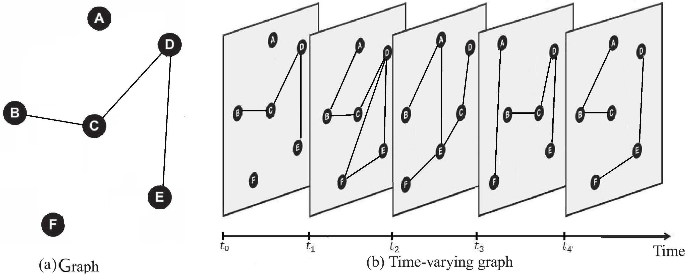
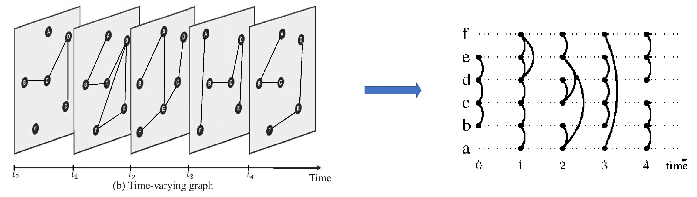
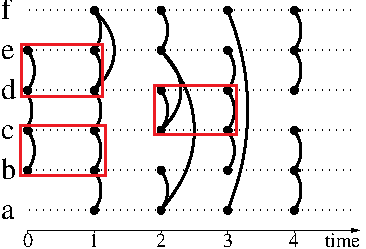
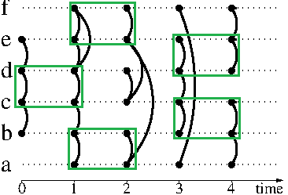
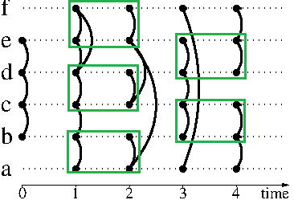

# Temporal-Matching-in-Link-Streams

We present the problem of finding maximum matching edges in temporal graph, for this we use a sequence of pairs of edges of the form (t,{u,v}), that we call a link stream.

We can see an example of temporal graph:

The link stream corresponding:

Definition:  Let L= (V,T,E):
    * V set of vertices in the graph
    * T⊆N an integer represents a discretized time instant
    * E⊆{(t,uv) : t∈T ∧ u ∈ V ∧ v ∈ V ∧ u!=v}

Temporal matching

Let L= (V,T,E) a link stream and γ an integer
A γ-edges is set of repeated edges between vertices u and v starting at t and ending at t +γ- 1:{(t’,{u,v})|t’∈[t, t+γ-1]}.

Two γ-edges Γ1= (t1,u,v) and Γ2= (t2,u′,v′) are independent if t1>t2+γ−1. (t1<t2+γ−1) where u!=u′ and v!=v′

Definition:  A γ-matching is a set of independent γ-edges.

Computing a maximum temporal matching is NP-hard, we introduce a way to compute a 2-approximation with two greedy algorithms Ls and DC:
* Local search heuristic (LS)
With the same example, we have this γ-matching

* Divide and conquer heuristic (DC)
With DC, we have this γ-matching
